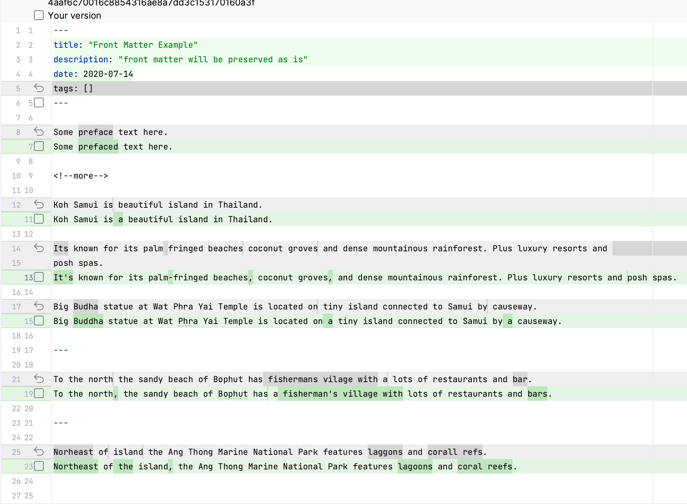

# README

This is a Python script that takes in a markdown file, parses the content, and uses OpenAI's GPT-3.5-turbo model to fix the grammar and punctuation of the text content while keeping markdown and HTML tags as is.



## Requirements

- Python 3.6 or higher
- OpenAI Python package

## Environment Variables

- `OPENAI_API_KEY`: Your OpenAI API key.

## Usage

```bash
python main.py <input_path> [output_path]
```

- `input_path`: The path to the markdown file you want to fix.
- `output_path` (optional): The path where the fixed file will be saved. If not provided, the original file will be overwritten.
